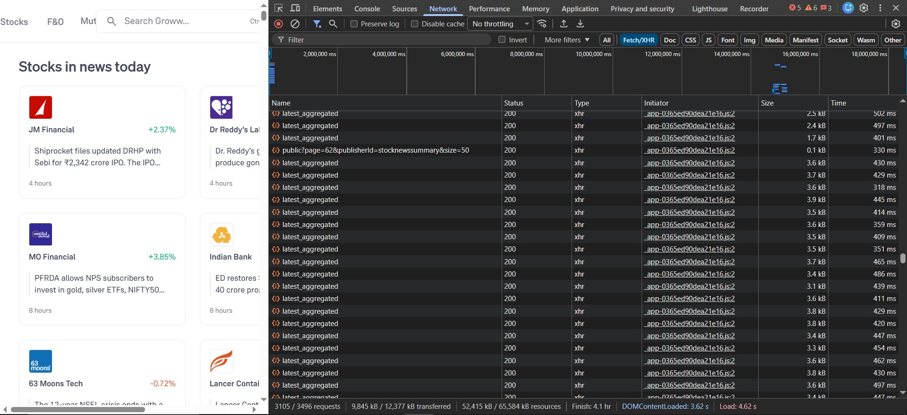
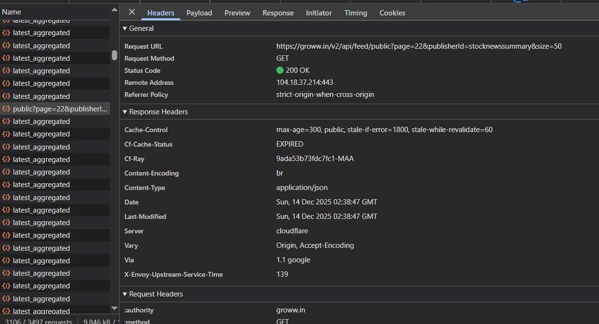
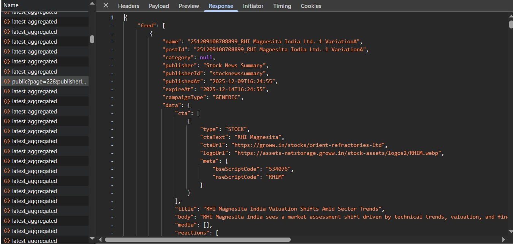
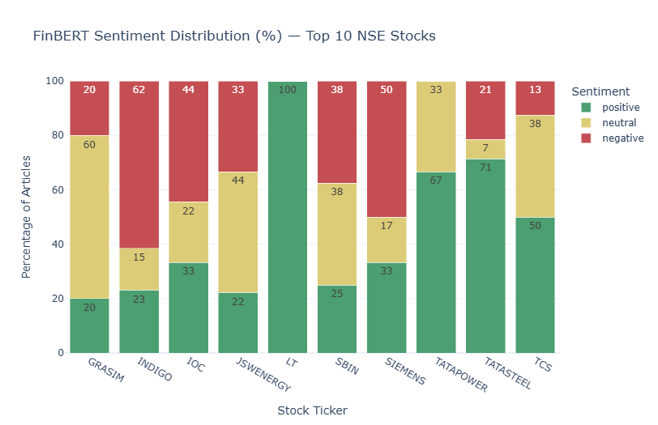
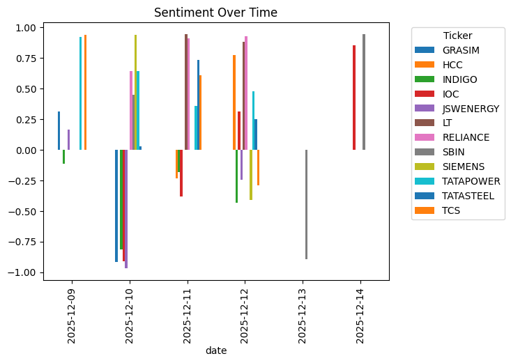
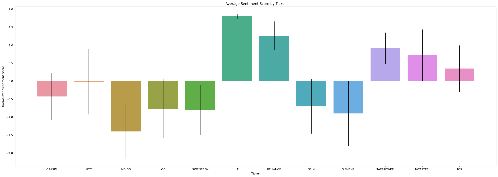
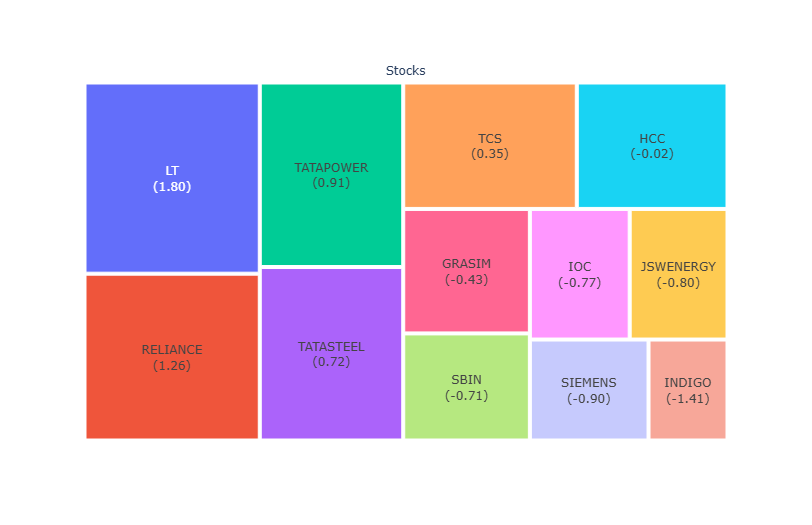
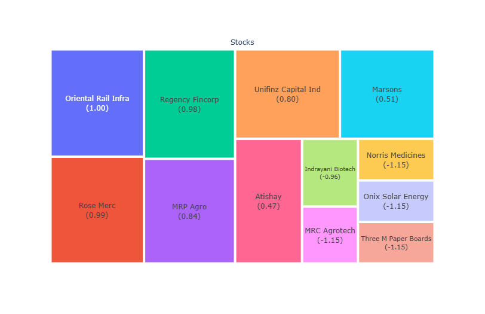

# 📰 Indian Stock News Sentiment Analysis
---
# 📌 Overview

This project performs sentiment and emotion analysis on Indian stock market news (NSE & BSE).
News is ingested using Groww’s public API, processed with Pandas, analyzed using FinBERT (financial sentiment transformer), enriched with NRC Emotion Lexicon, and visualized using Matplotlib, Plotly, and Seaborn.
The project was developed and executed in a Kaggle Notebook environment.

---

# 🛠️ Technologies Used
- Python 3
- Pandas
- NumPy
- BeautifulSoup (bs4) – static HTML exploration
- Requests – API ingestion
- HuggingFace Transformers
- ProsusAI/finbert
- NRC Emotion Lexicon
- Matplotlib
- Plotly Express / Plotly Graph Objects
- Seaborn
- Groww API (Stock News Feed)

---
# ✨ Features

## 🔍 Data Collection

- Initial exploration via BeautifulSoup (static HTML).
- Final data ingestion via Groww API (dynamic JavaScript-driven backend).
- Supports NSE and BSE stocks with proper ticker extraction.

## 📰 News Parsing
- Each news item contains:
- Stock ticker (NSE or BSE)
- Company name
- Publication date
- News headline + description

## 😊 Sentiment Analysis (FinBERT)
Uses FinBERT, a transformer model trained specifically on financial text.

Classifies news into:
- Positive
- Neutral
- Negative

Outputs:
- Sentiment label
- Confidence score

## 🔄 VADER-style Sentiment Mapping
FinBERT output is converted into a VADER-like compound score:

- positive → +confidence  
- neutral  → 0  
- negative → -confidence

This allows:
- Time-series analysis
- Normalization
- Cross-stock comparison

--- 
# 🏗️ How I Built It
## 1️⃣ Static HTML Attempt (Why It Failed)

Scraped Groww’s website using BeautifulSoup

Limitations:

- No reliable NSE/BSE ticker extraction
- Sparse and inconsistent data
- Conclusion: Not suitable for sentiment analysis

## 2️⃣ API Ingestion (Correct Approach) for Dynamic HTML Pages
Steps to get API Params
- Ctrl+Shift+I (Developer Tools)
- Network Tab
- Fetch/XHR
- Click on a request object
- Headers
- Request URL = API URL and User-Agent = user-agent
- Payload = Body of the Request
- Response = Server's Response to the request -> **The actual data we need**

  
*Fig. 1 Open Devtools*  
 
*Fig. 2 Headers*  
 
*Fig. 3 User-Agent in Headers* 
 
*Fig. 4 Payload* 
 
*Fig. 5 Response* 

## 3️⃣ Data Cleaning & Structuring
- Removed source tags and newline artifacts
- Unified NSE and BSE datasets
- Ensured:
  - No missing values
  - Proper date parsing
  - Clean text for NLP models

## 4️⃣ Sentiment Scoring
Batch inference using FinBERT
Extracted:
  - Sentiment label
  - Confidence score
Generated compound sentiment metric

---

# 📊 Key Visualizations (Core Insights)
These graphs form the analytical backbone of the project:

## 📌 Market Sentiment Distribution
Donut / pie chart showing:
- Positive
- Neutral
- Negative
Helps gauge overall market mood

## 📌 Percentage-wise Stacked Bar Chart
- Top NSE stocks
- Shows sentiment composition (%) per stock
- Ideal for relative comparison

## 📌 Sentiment Over Time
Mean compound sentiment per stock per day
Highlights:
- Market reactions
- News-driven volatility
- Trend reversals

## 📌 Normalized Sentiment (Z-Score)
- Standardizes sentiment across stocks
- Includes error bars (volatility)
- Answers:
“Which stocks are relatively most positive or negative?”

## 📌 Heatmap (Stock × Date)
- Visualizes sentiment evolution
- Identifies sentiment clusters and spikes

## 📌 Treemap (NSE & BSE)
- Size represents relative sentiment strength
- Fast visual ranking of sentiment dominance
---

# 📈 Additional Visualizations (Deeper NLP Insights)
## 🟦 Word Clouds

- Positive Word Cloud
- Negative Word Cloud

Highlights frequently used finance-related terms

## 🎭 Emotion Analysis (NRC Lexicon)

Using the NRC Emotion Lexicon (14,000+ words), emotions are mapped into finance-relevant categories:

- Greed
- Fear
- Panic
- Optimism
- Pessimism
- Confidence
- Uncertainty

## 🎯 Emotion-Based Visuals
- Stacked Emotion Bar Charts
- Emotion Radar Chart (per stock)
- Emotion Composition Comparison

These visuals explain how the market talks about a stock, not just whether sentiment is positive or negative.

--- 
# 📚 What I Learned
## 🧠 API Reverse Engineering
- Inspecting network traffic
- Understanding payloads, headers, and responses
- Handling pagination and dynamic feeds

## 🔧 Data Engineering
- Cleaning unstructured financial text
- Merging multi-exchange datasets
- GroupBy + Unstack workflows
- 🤖 NLP for Finance
- Differences between VADER and FinBERT
- Why domain-specific models matter
- Mapping transformer outputs into interpretable metrics

## 📊 Advanced Visualization
- Sentiment normalization
- Error bars and volatility
- Multi-dimensional visual storytelling

---

# 🚀 How It Can Be Improved
- Add real-time ingestion (cron / Airflow)
- Extend beyond Groww (NewsAPI, Twitter, Reddit)
- Build an interactive dashboard (Streamlit / Dash)
- Store historical data in SQL/NoSQL
- Predict price movement using sentiment trends
- Sector-wise and index-wise sentiment aggregation

---
#Graphs

  
*Graph 1 Market Sentiments* 
 
*Graph 2 Percentage of Sentiments Per Stock* 
 
*Graph 3 Sentiment Over Time Per Stock Per Date* 
 
*Graph 4 Normalized average sentimens per stock* 
 
*Graph 5 Heatmap per stock per date of normalized data* 
 
*Graph 6 TreeMap of NSE Top 10* 
 
*Graph 7 TreeMap of BSE Top 10* 
 
*Graph 8 Emotion Stack Bar Graph* 
 
*Graph 9 Radar Chart of Emotions* 
 
*Graph 10 Positive Wordcloud* 
 
*Graph 11 Negative Wordcloud* 

